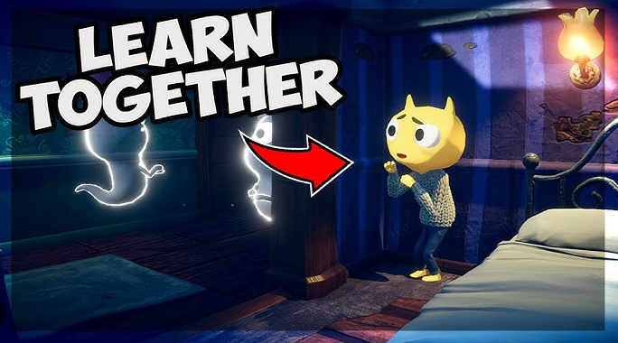

# 🎃 John Lemon’s Haunted Jaunt (Unity 3D Beginner Project)

Acesta este proiectul **John Lemon’s Haunted Jaunt**, parcurs în cadrul cursului **[Unity Learn | 3D Beginner Pathway](https://learn.unity.com/project/john-lemon-s-haunted-jaunt-3d-beginner)**.

Am urmat pas cu pas tutorialul, învățând concepte de bază precum:
- Navigație 3D și sistemul NavMesh;
- Iluminare și umbre în Unity;
- Configurarea camerei și a controlului personajului;
- Interacțiunea cu mediul și efecte de joc.

---

## 🧩 Descriere

**Scopul proiectului:** să îl ajuți pe John Lemon să exploreze un conac bântuit, evitând spiritele care îl patrulează prin camere.  
Proiectul este un exemplu excelent de inițiere în game design, logică de gameplay și organizare a scenelor în Unity.

---

## 🕹️ Captură din joc



*(Captură realizată în timpul rulării proiectului în Unity)*

---

## 🚀 Cum poți rula proiectul

1. Clonează repository-ul:
   ```bash
   git clone https://github.com/Filip-Felix/John-Lemon-s-Haunted-Jaunt
2. Deschide proiectul în Unity Hub

3. Rulează scena principală MainScene (sau JohnLemonScene)

4.Apasă Play și explorează conacul 👻
